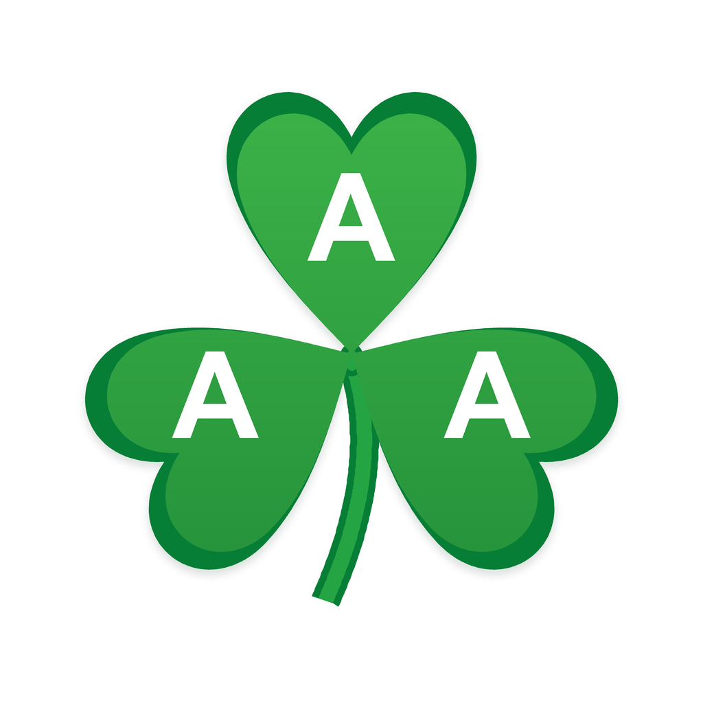

# AAAlab

<p align="center">
  
</p>

AAAlab stands for Autonomous AI Agent.

AAAlab is a collection of agent harnesses for scientific and engineering workflows.

The first harness is:

| Harness | Purpose | Install name |
|---|---|---|
| [autodock-vina-harness](harnesses/autodock-vina-harness/README.md) | Multi-agent AutoDock Vina / gnina docking execution, validation, reruns, troubleshooting, and QA | `$autodock-vina-harness` |

## Install All Harnesses

With npm:

```bash
npm install -g github:shkdidrlf/AAAlab
aaalab install
```

PowerShell:

```powershell
.\install.ps1
```

macOS/Linux:

```bash
./install.sh
```

Restart your agent runtime after installation so its skill or harness registry reloads.

## Install One Harness

PowerShell:

```powershell
.\install.ps1 -Harness autodock-vina-harness
```

macOS/Linux:

```bash
./install.sh autodock-vina-harness
```

npm:

```bash
aaalab install autodock-vina-harness
```

## Validate

Cross-platform npm validation:

```bash
aaalab validate
```

From a local clone:

```bash
npm test
```

## Repository Layout

```text
AAAlab/
  .github/
    workflows/
      validate.yml
  harnesses/
    autodock-vina-harness/
      skills/
        autodock-vina/
        autodock-vina-harness/
```

Each harness directory is expected to be self-contained enough to install independently, while the repo root provides shared validation and install entry points.

## GitHub Actions

The validation workflow at [.github/workflows/validate.yml](.github/workflows/validate.yml) runs all harness validators on push and pull request.

## License

AAAlab is licensed under Apache-2.0. Individual harnesses may include their own license audits and third-party notices for external tools they reference.
