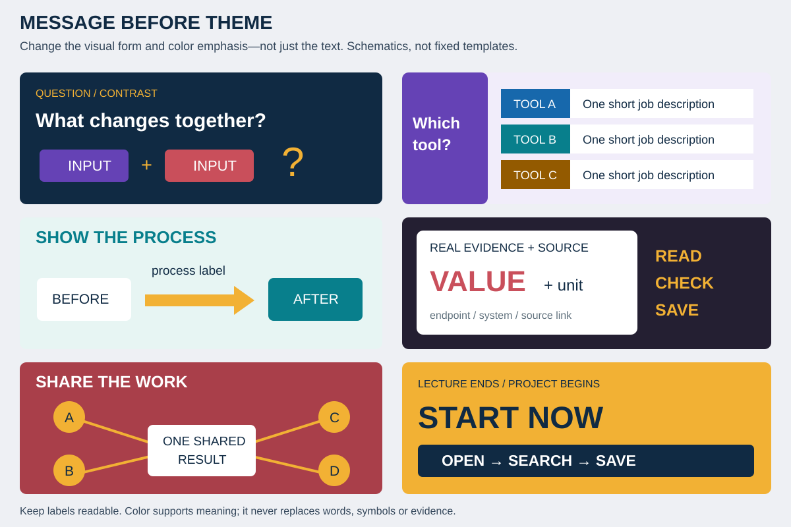

# Classroom Slide Design Harness

Short, visual lectures that lead directly into project work—not another fixed PowerPoint theme.

Developed from an instructor-approved redesign: a long, repetitive lecture became a ten-slide practical introduction. The reusable principles are published here; the private course files, original deck, workbook, compound examples and local paths are **not** included.



## What it preserves
- **Message before theme:** change color and composition to emphasize each key message.
- English slides for undergraduates with limited English: short verbs, large labels, genuine visual anchors.
- Default 15–20-minute introduction, about ten slides, then actual student work; adjust for the current course.
- Content-led visual variety: paths, mechanisms, structures/images, comparisons, annotated evidence, count diagrams and work maps. No repeated three-text-box formula or filler.
- A teaching editor → visual producer → independent reviewer pipeline, with actual rendering and iteration.
- Detailed explanations, timing and citations in speaker notes; essential operating rules remain visible.

## Install

```bash
npm install -g github:phdgil/AAAlab
aaalab install classroom-slide-design-harness
aaalab validate classroom-slide-design-harness
aaalab runtime-check classroom-slide-design-harness
```

One-shot:
```bash
npx --yes github:phdgil/AAAlab install classroom-slide-design-harness
```

Custom runtime homes:
```bash
aaalab install classroom-slide-design-harness --agent-home "$HOME/.codex"
aaalab install classroom-slide-design-harness --agent-home "$HOME/.claude"
# GJC user skill directory: <config>/agent/skills
aaalab install classroom-slide-design-harness --agent-home "$HOME/.gjc/agent"
```

The CLI defaults and replacement behavior are shared with the repository installer: an existing installed skill of the same name is replaced. Keep course-specific feedback/source outside the installation before upgrading. Installation does not install Python packages or Microsoft Office. Restart the agent runtime after installation.

Requirements: Node.js 18+ for the AAAlab manager; Python 3.10+ with python-pptx and Pillow for auditing. Desktop PowerPoint and pywin32 are needed only for the Windows Office rendering path. A skill-enabled agent with editing tools creates the deck; the package itself is not a fixed-layout slide generator.

From a repository clone, use `bash install.sh` or `./install.ps1` in this directory. The wrappers use the root Node CLI. Manual copy: `skills/classroom-slide-design-harness` → `<agent-home>/skills/classroom-slide-design-harness`; retain the repository Apache license and this package's notices when redistributing.

## Use

```text
Use $classroom-slide-design-harness to redesign this undergraduate lesson.
Students have limited English, but slides must be in English.
I have 15–20 minutes to explain before they begin the project.
Use color changes to emphasize the message, not to preserve one theme.
Save editable PPTX, PDF and review images in the course directory.
```

```text
$classroom-slide-design-harness로 이번 수업 슬라이드를 설계해줘.
영어가 익숙하지 않은 학부생 대상이고, 설명은 17분 뒤 실습을 시작할 것.
단조로운 테마보다 핵심 메시지의 색상 강조가 중요함.
지난번 피드백을 읽고 구조·레이아웃·읽기 부담을 검토해줘.
```

For later iterations:
```text
Use $classroom-slide-design-harness to improve slides 4 and 7 only.
Preserve the other slides and the source workbook.
Apply the recorded feedback, rerender, and request an independent review.
```

The protocol works with different runtimes; `$skill-name` is an example invocation syntax. Role definitions are in `references/roles.md`, not a requirement for one vendor's model. Without delegation, self-review must be disclosed.

## Contents

Inside `skills/classroom-slide-design-harness/`:
- `SKILL.md`: context, teaching edit, visual production, rendering, review, release and repeat-use workflow.
- `references/roles.md`: coordinator, producer and independent reviewer contracts.
- `references/visual-playbook.md`: message-to-layout choices, color, hierarchy and scientific/data safeguards.
- `assets/layout-atlas.svg`: original, data-free visual examples; inspiration rather than a compulsory theme.
- `references/trigger-tests.md`: invocation boundaries and failure scenarios.
- `templates/brief.example.json`: an adaptable 17-minute storyboard, not a mandatory template.
- `templates/feedback.example.json`: retain user feedback without claiming a completed evaluation.
- `scripts/audit_pptx.py`: non-mutating structural audit; optional PowerPoint render, PDF, images and contact sheet.
- `scripts/test_audit_pptx.py`: focused behavioral tests using generated fixtures.

The package intentionally does not include a universal ten-slide generator: the producer builds slides for the current message. It does include the workflow and audit tooling needed to iterate consistently without forcing every lesson into the same visual pattern.

## Audit and render

Set `SKILL` to the installed skill directory, then:
```bash
python -m pip install -r "$SKILL/scripts/requirements.txt"
python "$SKILL/scripts/validate_harness.py"
python "$SKILL/scripts/test_audit_pptx.py"
python "$SKILL/scripts/audit_pptx.py" lesson.pptx --output-dir review-01
```

Windows with desktop PowerPoint and pywin32:
```powershell
python "$SKILL/scripts/audit_pptx.py" lesson.pptx --output-dir review-02 --render-office
```

Use a new output directory for each revision. Existing nonempty output directories are refused unless `--overwrite` is explicitly supplied. Do not target a source directory. The source deck is hashed and never modified.

Structural-only checks cannot establish rendered readability, contrast, or learning effectiveness. Office rendering requires Windows, pywin32 and an installed usable PowerPoint application; the requested operation fails explicitly when unavailable. Other renderers may be used by the agent with their own clearly reported verification—not silently substituted by the script. Independent visual review is still required for a visually approved claim.

## Iteration and privacy

Keep the active brief, evidence ledger, generator, protected-input hashes and feedback in the course workspace. Update generalized rules only after feedback warrants it; do not fork a new harness for every revision. Never publish the workspace as part of a harness update. The design rules are reusable; data, identities and sharing permissions are lesson-specific.

## License and attribution

Original protocol and scripts: Apache-2.0, under the repository license. Inspired by the role separation and producer-reviewer ideas in [revfactory/harness](https://github.com/revfactory/harness); that plugin is not installed or bundled. See `NOTICE`, `LICENSE_AUDIT.md` and `THIRD_PARTY_NOTICES.md` for external dependencies and limitations.
